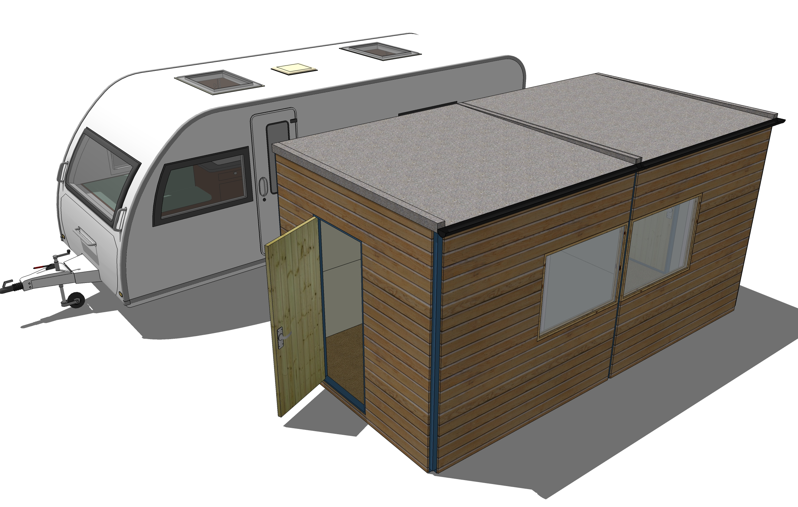

# Build a DIY home/office you can fit in your car
This is the home of the MakeHouse project, an Open Source home, office or house extension building system that you can fit in your car.

## What problems does this system solve?
When I started remote working I needed some office space. I used the spare room for a while but then a baby came along. Guess who got preference when it came to nap time? I looked around for a self-build office I could stick in the back garden and found lots of nice looking but incredibly expensive options. Furthermore, to insulate, waterproof and create an interior finish with these buildings was pretty much impossible given the time I had to spare. Essentially, nothing measures a standard length so I spent most of my time cutting and measuring, creating lots of expensive and eco-unfriendly scrap. The worst of it is that the sheet materials required don't fit in your car, and if you decide to measure up and provide cutting lists to the man at the DIY store, you're in for hours (or days, in my case) of non-productive time measuring and re-measuring, then working out how to best make use of the sheet size you buy. Inevitably, lots more scrap.

In a previous life I used to be a design engineer by trade so I set about designing my own; driven by the bad experiences I had with off the peg solutions.

## So what I want is:

- Cheap! A 2.5m x 2.5m x 2.5m **insulated and finished** building should cost £1000 or less
- All materials can be fitted into a family size car
- It can be built and put up by one person
- It is fully insulated to walls, floor and ceiling
- It can be extended simply and cheaply without destroying what's been built already
- Weatherproof
- Double glazed windows
- Minimal potential for condensation (and therefore mould growth) inside
- Can be put up without a foundation (foundations are *very* expensive and eco unfriendly)
- I can disassemble and put it back in my car when I want to move
- Contains only standard size parts 

This list is a tall order, and to my knowledge a building that does all this has never been achieved. I think the **MakeHouse** system solves all these challenges and I hope you find it useful for your own home office, house extension or even your home!

### Note on the reason for adopting standard parts
The reason having standard parts is a big deal is down to economy of scale. If this system catches on, the components in this system can be created by third parties and ordered off-the-shelf for much cheaper than you or I could make them ourselves. The hope is that some micro-businesses might be viable to service each local market, manufacturing and installing homes and garden buildings based on this system.
